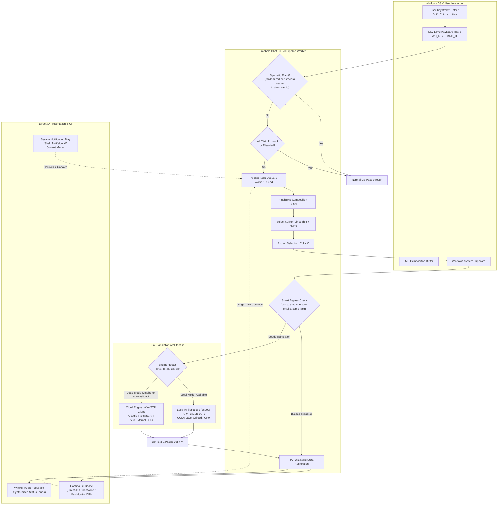

[](https://teamsunplaza.gumroad.com/l/emebala)

# Emebala Chat — Ultra-Fast Native Real-Time Translation for Windows

[](https://github.com/teamsunplaza/Emebalachat/releases)
[](https://teamsunplaza.gumroad.com/l/emebala)
[](https://en.cppreference.com/w/cpp/20)
[](https://microsoft.com/windows)
[](LICENSE)
[](https://github.com/ggerganov/llama.cpp)
[](#floating-pill-badge-ui)

> ### **"Never copy-paste again. Type in your language, and let Emebala Chat translate and replace your text in real-time anywhere."**
>
> **Type in your language. It replaces your text with the translation in real-time.**  
> *No more copy-paste context switching (복붙 없는 번역).*

### ⚡ The 3-Step Magic: Type ➔ Translate ➔ Replace (and Send)

- ⌨️ **Type** — Type naturally in your native language (Discord, Slack, in-game chat, browser, anywhere; editor/IDE windows are deliberately excluded from the Enter pipeline).
- ⚡ **Translate** — Offline local AI (**Hy-MT2-1.8B** via llama.cpp) or cloud engine (Google Translate, no API key).
- 🚀 **Replace** — Your original keystrokes are automatically erased and replaced with the translated text, right where your cursor is. In **Auto-Send** mode (or in chat apps where <kbd>Enter</kbd> sends), the translated text is sent too.

---

**Emebala Chat** (에메발라챗) is an ultra-fast native Windows translation tool engineered in pure modern C++20 and Win32 APIs. It intercepts input text across Windows applications (Discord, Slack, KakaoTalk, browsers, in-game chats, and most other text inputs), translates it via the local LLM or the consent-gated cloud engine, and places the translated text into the active input field with zero clipboard pollution. Editor/IDE windows are deliberately excluded from the Enter-translate pipeline (see Key Features §1).

---

## 📑 Table of Contents

- [Executive Overview](#-executive-overview)
- [Architecture & Tech Stack](#-architecture--tech-stack)
- [Key Features](#-key-features)
  - [Zero-Latency Keyboard Hook & Anti-Reentrancy](#1-zero-latency-keyboard-hook--anti-reentrancy)
  - [Dual Translation Engines (Local AI + Cloud Fallback)](#2-dual-translation-engines)
  - [Floating Pill Badge UI (Direct2D / DirectWrite)](#3-floating-pill-badge-ui)
  - [Zero-Leak Clipboard Safety & Privacy](#4-zero-leak-clipboard-safety--privacy)
  - [Smart Content Bypass](#5-smart-content-bypass)
  - [Supported Languages (38 Languages)](#6-supported-languages-38-languages)
- [Global Hotkeys & Mouse Gestures](#-global-hotkeys--mouse-gestures)
- [Project Structure](#-project-structure)
- [Building from Source](#-building-from-source)
  - [Prerequisites](#prerequisites)
  - [Configure & Build (CMake + Ninja)](#configure--build-cmake--ninja)
  - [Running Unit Tests](#running-unit-tests)
- [Installer Generation (Inno Setup)](#-installer-generation-inno-setup)
- [Configuration Reference (`config.json`)](#-configuration-reference-configjson)
- [Security & Privacy Guarantee](#-security--privacy-guarantee)
- [Support & Sponsorship](#-support--sponsorship)
- [Credits & Acknowledgments](#-credits--acknowledgments)
- [License](#-license)

---

## 🚀 Executive Overview

Traditional desktop translation utilities suffer from clunky Electron wrappers, slow response times (> 500ms), privacy leaks into Windows Clipboard History (`Win+V`), or awkward copy-paste manual workflows.

**Emebala Chat** eliminates all of these pain points:
- **Instantaneous Native Performance**: Built in pure C++20 with MSVC static runtime (`/MT`), linking directly against Win32, Direct2D, DirectWrite, and WinHTTP.
- **Dual-Engine Flexibility**:
  - **Local AI Engine**: Powered by [llama.cpp](https://github.com/ggerganov/llama.cpp) tag `b6099` loading Tencent's **Hy-MT2-1.8B** (Q8_0 quantized model, ~1.9 GB). GPU offload (`n_gpu_layers = 99`, CUDA sm_75+), with automatic CPU-only fallback when CUDA hardware or drivers are absent.
  - **Cloud Engine**: Built-in, high-speed asynchronous WinHTTP Google Translate client that requires **zero API keys and zero external runtime DLLs**. Cloud use is consent-gated (see [Security & Privacy](#-security--privacy-guarantee)).
- **Invisible In-Place Translation**: Type naturally in your native language, press <kbd>Enter</kbd>, and watch the text instantly transform—working in any chat, form, or document field. By default the translated text only **replaces** what you typed; toggling Auto-Send (<kbd>Ctrl</kbd>+<kbd>Shift</kbd>+<kbd>Enter</kbd>) makes the app also **send** it for you.
- **Hardware-Accelerated Minimalist UI**: Non-intrusive floating pill badge rendered via hardware Direct2D displaying real-time translation state and language pairs.

---

## 🏗 Architecture & Tech Stack



---

## ✨ Key Features

### 1. Zero-Latency Keyboard Hook & Anti-Reentrancy
- Installs an asynchronous low-level keyboard hook (`WH_KEYBOARD_LL`) running on a dedicated message-pump thread.
- **Re-entrancy Protection**: All synthetic key events emitted by Emebala Chat embed a per-process randomized signature marker `EXTRA_INFO_MARKER` (chosen at startup from QPC + PID + ASLR entropy, never a compile-time constant) into `KBDLLHOOKSTRUCT::dwExtraInfo`. The hook instantly ignores all flagged synthetic events, preventing recursive keystroke loops, while third-party processes cannot predict the value to spoof bypassed input.
- **IME Composition Flushing**: Simulates a synthetic right-arrow advance before selection to force Windows CJK/Korean IME composition buffers into committed strings. Enter pressed while an IME composition is open commits the composition first (Korean IMEs route Enter as the commit keystroke), and the translation pipeline only fires when composition state allows it.
- **Pass-through Safety**: <kbd>Shift</kbd>+<kbd>Enter</kbd> (newline), <kbd>Ctrl</kbd>+<kbd>Enter</kbd>, <kbd>Alt</kbd>-bearing and <kbd>Win</kbd>-bearing combinations pass through unhindered. Editor/IDE foreground apps (VS Code family, Cursor, Windsurf, VSCodium, and AI CLI editors, per `kEditorApps`) are excluded from the Enter-translate pipeline entirely, so a bare Enter never captures a whole document there.

### 2. Dual Translation Engines
- **Local AI Engine**:
  - Direct C++ integration with `llama.cpp` (b6099).
  - Employs **Tencent Hy-MT2-1.8B** (Q8_0 quantization, ~1.9 GB) across the 37 target languages listed below.
  - GPU offload via CUDA (`n_gpu_layers = 99`, Compute Capability 7.5+ / Turing and newer), automatically falling back to a CPU-only model load when CUDA hardware or drivers are absent.
  - Model file integrity is verified with a SHA-256 hash (cached in a `<model>.sha256ok` marker keyed on size + mtime) before the model is handed to llama.cpp.
  - Pairs outside the model's reliable set are routed to the cloud engine under `auto`, or kept on-device (with a degradation warning) under a strict `local` pin without cloud consent.
- **Built-in Cloud Engine**:
  - Native asynchronous HTTP client built on `winhttp.dll`.
  - Communicates directly with Google Translate HTTPS endpoints.
  - Requires **no Google Cloud API keys**, no Python runtimes, and zero third-party dynamic libraries.
  - Consent-gated: the `auto` engine policy documents cloud fallback when the local model is absent or a local attempt fails, but with `engine_type` pinned to `local`, nothing is ever sent to the cloud unless you explicitly set `cloud_fallback_enabled` to `true` (default `false`).

### 3. Floating Pill Badge UI
- **Hardware-Accelerated Direct2D / DirectWrite**:
  - Lightweight, semi-transparent rounded pill badge rendered with hardware acceleration.
  - Per-monitor DPI awareness (`PerMonitorV2`), rendering crisp typography on 1080p, 1440p, and 4K displays.
  - Dynamic width calculation based on active language labels and status state.
- **Interactive Mouse Gestures**:
  - **Left Click**: Instantly toggle translation between Active and Paused.
  - **Double Click**: Swap the typing source and target languages.
  - **Right Click**: Open the full context menu (engine selection, UI language, typing/drag language pairs, Auto-Send, Sound, Show Badge, Start with Windows, About, Cheat Sheet, Exit).
  - **Left Drag**: Freely reposition anywhere across your displays; coordinates automatically persist in `config.json`.

### 4. Zero-Leak Clipboard Safety & Privacy
- Standard translation tools overwrite the user's clipboard and expose sensitive text to Windows 10/11 Clipboard History.
- Emebala Chat implements comprehensive privacy protections:
  - Registers Windows Clipboard Monitor exclusion format tags:
    - `ExcludeClipboardContentFromMonitorProcessing`
    - `CanIncludeInClipboardHistory` (explicitly set to 0)
    - `CanUploadToCloudClipboard` (explicitly set to 0)
  - **RAII State Backup & Restore**: Completely snapshots existing clipboard contents (including non-text formats while safely skipping volatile GDI handles), performs the paste operation, and restores the original clipboard state afterwards.
  - **Paste Settle Timing**: After setting the clipboard, the synthetic paste waits a fixed 120 ms settle delay (`kPasteSettleDelayMs`) before sending <kbd>Ctrl</kbd>+<kbd>V</kbd>, and clipboard reads poll `AddClipboardFormatListener` sequence changes with a timeout gate so a stale copy is never read.

### 5. Smart Content Bypass
Avoids wasting compute or generating corrupted translations on non-translatable text:
- **URLs & Links**: Automatically detects `http://`, `https://`, `ftp://`, `www.`, and root domain URLs.
- **Numbers & Math**: Skips pure digits, formulas, timestamps, and currency amounts.
- **Emojis & Emoticons**: Skips strings consisting solely of Unicode emojis, symbols, and punctuation.
- **Script Compatibility**: Translation requests are skipped when the source text's script cannot produce the target language's script (e.g. Latin-only text typed while the target is Korean/Chinese/Japanese).
- **Already-Target Equivalence**: When the source language is `Auto Detect` and the detected language equals the target language (e.g. typing English while target is set to English), translation is skipped. With an explicitly pinned source language the request is always honored.

### 6. Supported Languages (38 Languages)

Emebala Chat supports full bidirectional translation across **38 language entries** with full native and localized name recognition:

| Code | English Name | Native Name | Code | English Name | Native Name |
|:----:|:-------------|:------------|:----:|:-------------|:------------|
| `AUTO` | Auto Detect | 자동 감지 | `ID` | Indonesian | Bahasa Indonesia |
| `KO` | Korean | 한국어 | `MS` | Malay | Bahasa Melayu |
| `EN` | English | English | `FIL`| Filipino | Filipino |
| `VI` | Vietnamese | Tiếng Việt | `KM` | Khmer | ភាសាខ្មែរ |
| `ZH-CN` | Chinese Simplified | 简体中文 | `LO` | Lao | ພາສາລາວ |
| `ZH-TW` | Chinese Traditional | 繁體中文 | `HI` | Hindi | हिन्दी |
| `JA` | Japanese | 日本語 | `BN` | Bengali | বাংলা |
| `ES` | Spanish | Español | `TR` | Turkish | Türkçe |
| `FR` | French | Français | `PL` | Polish | Polski |
| `DE` | German | Deutsch | `NL` | Dutch | Nederlands |
| `RU` | Russian | Русский | `UK` | Ukrainian | Українська |
| `TH` | Thai | ไทย | `FA` | Persian | فارسی |
| `AR` | Arabic | العربية | `UR` | Urdu | اردو |
| `PT` | Portuguese | Português | `HE` | Hebrew | עברית |
| `IT` | Italian | Italiano | `CS` | Czech | Čeština |
| `HU` | Hungarian | Magyar | `SV` | Swedish | Svenska |
| `EL` | Greek | Ελληνικά | `RO` | Romanian | Română |
| `DA` | Danish | Dansk | `FI` | Finnish | Suomi |
| `NO` | Norwegian | Norsk | `MY` | Burmese | မြန်မာစာ |

---

## ⌨ Global Hotkeys & Mouse Gestures

| Trigger | Action | Description |
|:--------|:-------|:------------|
| <kbd>F9</kbd> | **Toggle Active / Paused** | Enables or pauses real-time translation with audio chime + on-screen notice (default `hotkey_toggle` value; configurable, see below) |
| <kbd>Ctrl</kbd> + <kbd>F9</kbd> | **Cycle Target Language** | Cycles forward through the 37 target languages of the **typing** pair |
| <kbd>Ctrl</kbd> + <kbd>Shift</kbd> + <kbd>Enter</kbd> | **Toggle Auto-Send Mode** | Toggles whether <kbd>Enter</kbd> is automatically sent (chat apps) / a newline injected (editors) after translation |
| <kbd>Enter</kbd> | **Translate & Replace** | Intercepts the bare Enter, translates the current input block (only the block being typed after your last manual newline), replaces the text in place, and sends only when Auto-Send allows it |
| <kbd>Shift</kbd> + <kbd>Enter</kbd> | **Newline Pass-through** | Inserted by the host app untouched (chat-app convention); counted internally so the next <kbd>Enter</kbd> translates only the newest block |
| <kbd>Ctrl</kbd> + <kbd>Enter</kbd> / <kbd>Alt</kbd> + <kbd>Enter</kbd> | **Bypass Pass-through** | Always passed directly to host application (Excel newline / full screen, etc.) |
| **Double <kbd>Ctrl</kbd>+<kbd>C</kbd>** | **Translate Selected Text** | Drag-to-translate capture of the current selection (tooltip result card); the only supported `drag_hotkey` pattern |
| **Badge Left-Click** | **Pause / Resume** | Toggles active translation status |
| **Badge Double-Click**| **Swap Languages** | Swaps the typing source and target language pair |
| **Badge Right-Click** | **Context Menu** | Opens the same menu as the tray icon (engine, UI language, typing & drag language pairs, toggles, About, Exit) |
| **Badge Left-Drag** | **Reposition Window** | Moves badge across monitors; saves position persistently |

**Customizing hotkeys via `config.json`** — edit `hotkey_toggle` (default `"F9"`), `hotkey_lang` (default `"Ctrl+F9"`), and `hotkey_mode` (default `"Ctrl+Shift+Enter"`); values accept `Mod+Key`: Ctrl/Shift/Alt/Win + F1-F24, Enter, Esc, Tab, Space, Insert, Delete, Home, End, PgUp/PgDn, arrows, A-Z, 0-9. Invalid or empty values fall back to the compiled-in defaults. `drag_hotkey` supports only `"double_ctrl_c"`. When combos overlap, one action fires in order: toggle > lang > mode. Restart the app to apply changes.

---

## 📂 Project Structure

```
C:\path\to\Emebalachat\
├── CMakeLists.txt              # Primary CMake build specification (C++20, llama.cpp FetchContent)
├── LICENSE                     # MIT Permissive Open-Source License
├── README.md                   # This documentation
├── config.example.json         # Reference configuration template
├── installer\                  # Inno Setup 6.x packaging scripts
│   ├── README.md               # Installer build guide
│   ├── setup.iss               # Inno Setup installer script (0.10.0)
│   ├── languages\              # Bundled non-default .isl files (Chinese S/T)
│   ├── assets\                 # Optional setup icons & wizard graphics
│   └── output\                 # Compiled installer binaries
├── src\                        # Production C++20 source code
│   ├── app_icon.rc             # Embedded multi-size branded application icon
│   ├── bidi_utils.hpp/.cpp     # RTL script classification & first-strong direction detection
│   ├── config.hpp/.cpp         # Configuration serialization & 38-language database
│   ├── diag_logger.hpp/.cpp    # Per-run diagnostic log file (shape-only by default)
│   ├── engine.hpp/.cpp         # Dual-engine translation manager (llama.cpp + WinHTTP)
│   ├── google_translate.hpp/.cpp # Standalone WinHTTP Google Translate client
│   ├── hook.hpp/.cpp           # Asynchronous low-level keyboard hook (WH_KEYBOARD_LL)
│   ├── i18n.hpp/.cpp           # Internationalization and localization strings
│   ├── main.cpp                # Application entry point, mutex & message loop
│   ├── mouse_hook.hpp/.cpp     # Low-level mouse hook (drag-to-translate gestures)
│   ├── smart_bypass.hpp/.cpp   # Content filter (URLs, numbers, emojis, script matching)
│   ├── sound.hpp/.cpp          # Synthesized WinMM audio notifications
│   ├── unicode_utils.hpp/.cpp  # UTF-8 / UTF-16 conversion & script classification
│   ├── version.hpp             # Single source of truth for app name & version string
│   ├── win32_input.hpp/.cpp    # Simulated keyboard injection & RAII clipboard manager
│   ├── worker.hpp/.cpp         # Background pipeline worker thread
│   └── ui\                     # Hardware-accelerated presentation layer
│       ├── about_window.hpp/.cpp # About dialog (version, reset-to-defaults button)
│       ├── asset_loader.hpp/.cpp # PNG/ICO loading for D2D surfaces
│       ├── badge.hpp/.cpp      # Direct2D / DirectWrite floating pill badge
│       ├── dpi.hpp/.cpp        # Per-Monitor V2 DPI awareness helpers
│       ├── drag_icon.hpp/.cpp  # Draggable floating translation icon
│       ├── tooltip.hpp/.cpp    # Translation result tooltip card
│       └── tray.hpp/.cpp       # Shell_NotifyIconW system tray integration
└── tests\                      # Native unit test suite
    └── run_tests.cpp           # 2,048 unit checks covering all core modules
```

---

## 🔨 Building from Source

### Prerequisites
1. **Windows 10 / 11 64-bit** (Build 19041 or newer)
2. **Visual Studio 2022** (MSVC v143 toolset with C++20 support)
3. **CMake 3.24 or higher**
4. **Ninja Build** (recommended) or MSBuild
5. *(Optional for GPU Acceleration)* **NVIDIA CUDA Toolkit 12.x or 13.x**

### Configure & Build (CMake + Ninja)

Open **x64 Native Tools Command Prompt for VS 2022** and execute:

```powershell
# Navigate to project repository
cd C:\path\to\Emebalachat

# Configure CMake with Release optimization and Ninja generator
cmake -B build -G Ninja `
  -DCMAKE_BUILD_TYPE=Release `
  -DENABLE_LLAMA_FETCH=ON

# Compile core library, executable, and test suite
cmake --build build --config Release
```

The output binaries will be placed in `build\`:
- `build\Emebala_chat.exe` (Win32 GUI application)
- `build\run_tests.exe` (Unit test console runner)

### Running Unit Tests

Emebala Chat includes a self-contained unit test suite (2,048 checks as of v0.10.0) verifying every core module:

```powershell
.\build\run_tests.exe
```

Expected output (excerpt):
```text
========================================
  Emebalachat C++20 Core Test Suite
========================================
[RUN] Testing Config & Languages...
[PASS] Config & Languages tests completed.
[RUN] Testing Unicode & Normalization...
[PASS] Unicode & Normalization tests completed.
[RUN] Testing Smart Bypass...
[PASS] Smart Bypass tests completed.
...
Total Checks: 2048
Failures:     0
========================================
>>> ALL CORE TESTS PASSED SUCCESSFULLY! <<<
```

---

## 📦 Installer Generation (Inno Setup)

To package Emebala Chat into a single, self-extracting Windows installer:

1. Download and install [Inno Setup 6.1+](https://jrsoftware.org/isinfo.php).
2. Ensure `build\Emebala_chat.exe` has been compiled.
3. Run the Inno Setup compiler:

```powershell
& "C:\Program Files (x86)\Inno Setup 6\ISCC.exe" installer\setup.iss
```

The compiled installer will be output to:
```
installer\output\Emebalachat_Setup_0.10.0.exe
```

The installer offers:
- Automatic installation to `%ProgramFiles%\Emebalachat`
- Optional auto-start with Windows login
- Automatic download of the `Hy-MT2-1.8B-Q8_0.gguf` model from Hugging Face, verified against the SHA-256 hash pinned in `EXPECTED_MODEL_SHA256` (a pre-existing model file that fails verification triggers an explicit delete-and-redownload / keep decision)
- A generated `config.json` in the install folder; when the model download is skipped, it starts with `engine_type: "google"`
- Installer UI languages: English, Korean, Japanese, Chinese (Simplified), Chinese (Traditional)

---

## ⚙ Configuration Reference (`config.json`)

The canonical config file is `%LOCALAPPDATA%\Emebalachat\config.json`. On first launch, missing keys fall back to the compiled-in defaults (the app also one-shot migrates a legacy config found next to the executable). An example template is provided in `config.example.json`:

```json
{
  "ui_language": "auto",
  "engine_type": "auto",
  "model_path": "models/Hy-MT2-1.8B-Q8_0.gguf",
  "source_language": "Auto Detect",
  "target_language": "English",
  "auto_send": false,
  "sound_enabled": true,
  "drag_to_translate": true,
  "cloud_fallback_enabled": false,
  "diag_log_content": false,
  "drag_hotkey": "double_ctrl_c",
  "hotkey_toggle": "F9",
  "hotkey_lang": "Ctrl+F9",
  "hotkey_mode": "Ctrl+Shift+Enter",
  "temperature": 0.7,
  "top_p": 0.6,
  "top_k": 20,
  "repetition_penalty": 1.05,
  "badge_x": -1,
  "badge_y": -1
}
```

### Parameter Details:
- `ui_language`: Interface language (`"auto"` = follow Windows display language, or a locale code such as `"ko"`, `"en"`, `"ja"`, `"zh-CN"`, `"zh-TW"`). Changeable live from the tray menu.
- `engine_type`:
  - `"auto"` (default): Prefers local LLM if the model exists; falls back to Google Translate when the model is absent or a local attempt fails.
  - `"local"`: Strictly forces the local llama.cpp model. Cloud use then requires `cloud_fallback_enabled: true`.
  - `"google"`: Strictly forces Google Translate via WinHTTP.
- `model_path`: Relative or absolute path to the `.gguf` model file (relative paths resolve against the executable directory, not the working directory).
- `source_language` / `target_language`: Legacy single pair, kept only for migrating older configs. The runtime uses the two context pairs below.
- `drag_source_language` / `drag_target_language`: Language pair for **drag-to-translate** (tooltip/drag icon). Defaults: source `Auto Detect`, target = your Windows display language.
- `type_source_language` / `type_target_language`: Language pair for **typing** translation. Defaults: source `Auto Detect`, target `English`.
- `auto_send`: If `true`, an <kbd>Enter</kbd> keypress is synthesized after replacing text (chat send / editor newline). Default `false` (translation replaces text but does not send). Toggle live with <kbd>Ctrl</kbd>+<kbd>Shift</kbd>+<kbd>Enter</kbd>.
- `sound_enabled`: Enables synthesized audio tones for hotkey actions.
- `drag_to_translate`: Master switch for the drag-to-translate (double <kbd>Ctrl</kbd>+<kbd>C</kbd>) feature.
- `cloud_fallback_enabled`: Privacy consent gate. When `false` (default), a strict `local` engine pin NEVER sends your text to the cloud, even after a local failure. (Selecting `engine_type: "auto"` is itself the documented consent to the seamless cloud fallback.)
- `diag_log_content`: Diagnostic-log privacy gate. When `false` (default), logs record **shape only** — key codes, lengths, timings, window class. Set `true` to additionally record user content (typed characters, window titles, captured text, translation output). **Restart required.** Only enable while actively troubleshooting: your typed content will be written to disk.
- `drag_hotkey`: Drag-capture gesture pattern; only `"double_ctrl_c"` is supported.
- `hotkey_toggle` / `hotkey_lang` / `hotkey_mode`: Trigger combos in `Mod+Key` form (defaults `F9`, `Ctrl+F9`, `Ctrl+Shift+Enter`; invalid values fall back to defaults). Restart required.
- `temperature` / `top_p` / `top_k` / `repetition_penalty`: Sampling parameters for the local llama.cpp engine.
- `badge_x` / `badge_y`: Screen coordinates of the floating badge (`-1` places it at the bottom-right of the primary monitor, above the taskbar).

---

## 🔒 Security & Privacy Guarantee

- **No Remote Telemetry**: Emebala Chat contains zero tracking, zero telemetry, and zero third-party analytics.
- **Offline Capable**: In `local` engine mode with `Hy-MT2-1.8B`, all translation runs strictly offline on your local CPU/GPU. No text leaves your machine.
- **Cloud Consent Gate**: With `engine_type` pinned to `local` and `cloud_fallback_enabled: false` (the default), typed text is never transmitted to Google Translate — even after a local failure. Choosing `engine_type: "auto"` is itself the documented consent to cloud fallback when no local model is available.
- **Clipboard Isolation**: Temporary text placed on the clipboard is explicitly flagged with Windows privacy exclusions (`CanIncludeInClipboardHistory = 0`), preventing your sensitive messages from appearing in Windows Cloud Clipboard or <kbd>Win</kbd>+<kbd>V</kbd> history.
- **Model Integrity**: The GGUF model file is SHA-256 verified at install time (hash pinned in `installer/setup.iss`) and again at load time (with an on-disk marker cache), so a tampered model is refused instead of loaded.

### Diagnostic Logs (Privacy)

- **Location**: `%LOCALAPPDATA%\Emebalachat\logs\emebalachat_yymmddhhmmss.log` — one new file per app run.
- **Released default (`diag_log_content: false`)**: logs contain **no user content** — only shapes: virtual-key codes, modifier flags, window class names, text lengths, engine names, and timings. Typed characters, captured text, translation output, and window titles are NOT written.
- **Opt-in for troubleshooting**: set `"diag_log_content": true` in `config.json` and restart the app. This additionally records the typed character for each key, the foreground window title, the captured source text, and the translation output. Use it only while actively diagnosing an issue (the logs sit unencrypted on disk), and remove the flag afterwards.

---

## 💖 Support & Sponsorship

If **Emebala Chat** enhances your daily workflow, saves you from manual copy-pasting, or helps you communicate seamlessly across languages, consider supporting ongoing development:

[](https://teamsunplaza.gumroad.com/l/emebala)

Your support directly fuels local AI model performance tuning, new language features, and multi-platform expansion. Thank you!

---

## 🤝 Credits & Acknowledgments

- **Team Sunplaza** — Architectural design, native Win32/C++20 development, UI/UX, and maintenance.
- **[llama.cpp](https://github.com/ggerganov/llama.cpp)** by Georgi Gerganov and contributors — High-performance cross-platform LLM inference engine.
- **[Tencent Hunyuan](https://github.com/Tencent/HunyuanTranslation)** — Creator of the superb **Hy-MT2-1.8B** high-speed multilingual translation model.

---

## 📄 License

This project is licensed under the **MIT License**. See the [LICENSE](LICENSE) file for complete details.

Copyright (c) 2026 **Team Sunplaza**. All rights reserved.
