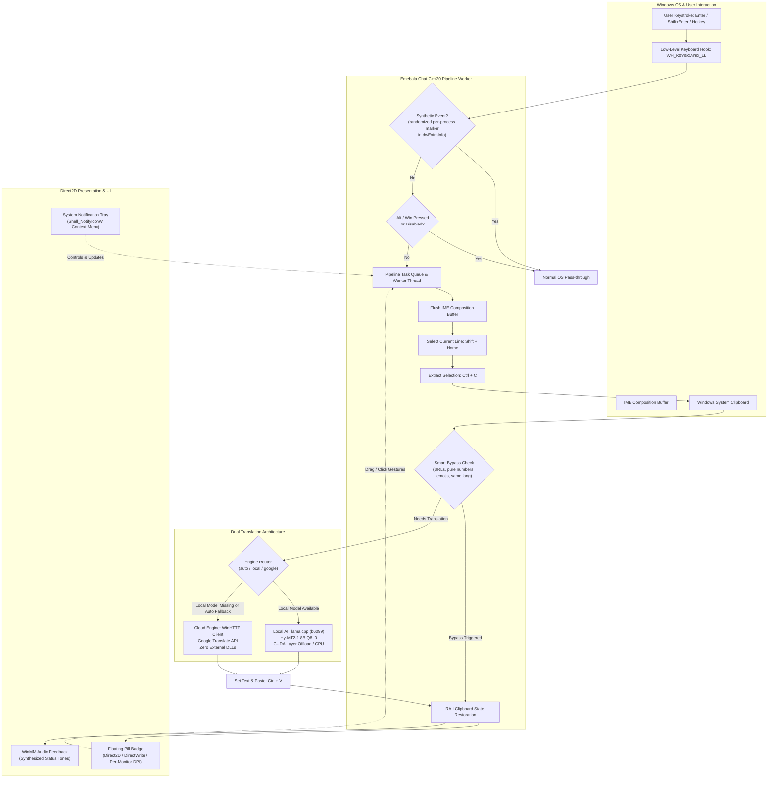

<p align="center">
  
</p>

<h1 align="center">Emebala Chat</h1>

<p align="center">
  <strong>Ultra-Fast Native Real-Time Translation for Windows</strong><br />
  "Never copy-paste again. Type in your language, and let Emebala Chat translate and replace your text in real-time anywhere."<br />
  <em>No more copy-paste context switching (복붙 없는 번역).</em>
</p>

<p align="center">
  <a href="https://github.com/teamsunplaza/Emebalachat/releases"></a>
  <a href="LICENSE"></a>
  <a href="https://microsoft.com/windows"></a>
  <a href="https://teamsunplaza.gumroad.com/l/emebala"></a>
</p>

<p align="center">
  <a href="#download-windows-10--11-x64">Download</a> ·
  <a href="#what-it-does">What it does</a> ·
  <a href="#key-features">Features</a> ·
  <a href="#global-hotkeys--mouse-gestures">Hotkeys</a> ·
  <a href="#configuration-reference-configjson">Configuration</a> ·
  <a href="#privacy--data-handling-technical"><strong>Privacy & Data Handling</strong></a> ·
  <a href="#support--sponsorship">Sponsor</a>
</p>

<p align="center">
  <a href="https://youtu.be/dhvRvJWc1L0">
    
  </a>
  <br>
  <em>🎬 <strong>Watch the 20-Second Product Promo on YouTube (1080p 60fps)</strong></em>
</p>

## What it does

Type naturally in your native language, press <kbd>Enter</kbd>, and the text you just typed is erased and replaced with its translation — right where your cursor is.

| Step | What happens |
|:-----|:-------------|
| **Type** | Type naturally in your native language (Discord, Slack, in-game chat, browser, anywhere; editor/IDE windows are deliberately excluded from the Enter pipeline). |
| **Translate** | Offline local AI (**Hy-MT2-1.8B** via llama.cpp) or cloud engine (Google Translate, no API key). |
| **Replace** | Your original keystrokes are automatically erased and replaced with the translated text, right where your cursor is. In **Auto-Send** mode (or in chat apps where <kbd>Enter</kbd> sends), the translated text is sent too. |

## What it is — and what it is not

**Emebala Chat** (에메발라챗) is an ultra-fast native Windows translation tool engineered in pure modern C++20 and Win32 APIs. It intercepts input text across Windows applications (Discord, Slack, KakaoTalk, browsers, in-game chats, and most other text inputs), translates it via the local LLM or the consent-gated cloud engine, and places the translated text into the active input field with zero clipboard pollution. Editor/IDE windows are deliberately excluded from the Enter-translate pipeline (see Key Features §1).

Traditional desktop translation utilities suffer from clunky Electron wrappers, slow response times (> 500ms), privacy leaks into Windows Clipboard History (<kbd>Win</kbd>+<kbd>V</kbd>), or awkward copy-paste manual workflows. **Emebala Chat** eliminates all of these pain points:

- **Instantaneous Native Performance** — Built in pure C++20 with MSVC static runtime (`/MT`), linking directly against Win32, Direct2D, DirectWrite, and WinHTTP.
- **Dual-Engine Flexibility**:
  - **Local AI Engine**: Powered by [llama.cpp](https://github.com/ggerganov/llama.cpp) tag `b6099` loading Tencent's **Hy-MT2-1.8B** (Q8_0 quantized model, ~1.9 GB). GPU offload (`n_gpu_layers = 99`, CUDA sm_75+), with automatic CPU-only fallback when CUDA hardware or drivers are absent.
  - **Cloud Engine**: Built-in, high-speed asynchronous WinHTTP Google Translate client that requires **zero API keys and zero external runtime DLLs**. Cloud use is consent-gated and structurally disclosed before first serve (see [Privacy & Data Handling](#privacy--data-handling-technical)).
- **Invisible In-Place Translation** — Type naturally in your native language, press <kbd>Enter</kbd>, and watch the text instantly transform—working in any chat, form, or document field. By default the translated text only **replaces** what you typed; toggling Auto-Send (<kbd>Ctrl</kbd>+<kbd>Shift</kbd>+<kbd>Enter</kbd>) makes the app also **send** it for you.
- **Hardware-Accelerated Minimalist UI** — Non-intrusive floating pill badge rendered via hardware Direct2D displaying real-time translation state and language pairs.

**It is not:** an Electron app, a clipboard-history polluter, or a telemetry client. Emebala operates **no servers** — see [Privacy & Data Handling](#privacy--data-handling-technical) §1.

## Download (Windows 10 / 11 x64)

Download **`Emebalachat_Setup_0.10.0.exe`** from [**Releases**](https://github.com/teamsunplaza/Emebalachat/releases) and run it. The installer offers:

- Automatic installation to `%ProgramFiles%\Emebalachat`
- Optional auto-start with Windows login
- Automatic download of the `Hy-MT2-1.8B-Q8_0.gguf` model from Hugging Face, verified against the SHA-256 hash pinned in `EXPECTED_MODEL_SHA256` (a pre-existing model file that fails verification triggers an explicit delete-and-redownload / keep decision)
- A generated `config.json` in the install folder; when the model download is skipped or declined, it starts with `engine_type: "google"` — cloud mode. This is safe by construction: the app's blocking first-run privacy notice discloses the Google transmission and no translation is served until you acknowledge it (see [Privacy & Data Handling](#privacy--data-handling-technical) §4).
- Bundling of this `README.md` into the install folder (`{app}\README.md`), so the first-run notice's "re-read this in the README file" guidance is actionable on a clean machine
- Installer UI languages: 32 languages registered in `[Languages]` (English, Korean, Japanese, Chinese Simplified/Traditional, plus 27 additional official Inno Setup translations)

> **Note on the default engine:** if you skip the ~1.9 GB model download during setup, the app starts on the Google cloud path — disclosed by a blocking first-run notice before anything can be translated. Read [Privacy & Data Handling §4](#4-the-automatic-fallback-disclosure-and-consent-gate-read-this-if-you-did-not-install-the-local-model) if you did not install the local model.

If it enhances your daily workflow: [**Sponsor on Gumroad**](https://teamsunplaza.gumroad.com/l/emebala).

## Key Features

### 1. Zero-Latency Keyboard Hook & Anti-Reentrancy

- Installs an asynchronous low-level keyboard hook (`WH_KEYBOARD_LL`) running on a dedicated message-pump thread.
- **Re-entrancy Protection**: All synthetic key events emitted by Emebala Chat embed a per-process randomized signature marker `EXTRA_INFO_MARKER` (chosen at startup from QPC + PID + ASLR entropy, never a compile-time constant) into `KBDLLHOOKSTRUCT::dwExtraInfo`. The hook instantly ignores all flagged synthetic events, preventing recursive keystroke loops, while third-party processes cannot predict the value to spoof bypassed input.
- **IME Composition Flushing**: Simulates a synthetic right-arrow advance before selection to force Windows CJK/Korean IME composition buffers into committed strings. Enter pressed while an IME composition is open commits the composition first (Korean IMEs route Enter as the commit keystroke), and the translation pipeline only fires when composition state allows it.
- **Pass-through Safety**: <kbd>Shift</kbd>+<kbd>Enter</kbd> (newline), <kbd>Ctrl</kbd>+<kbd>Enter</kbd>, <kbd>Alt</kbd>-bearing and <kbd>Win</kbd>-bearing combinations pass through unhindered. Editor/IDE foreground apps (VS Code family, Cursor, Windsurf, VSCodium, and AI CLI editors, per `kEditorApps`) are excluded from the Enter-translate pipeline entirely, so a bare Enter never captures a whole document there.

### 2. Dual Translation Engines

- **Local AI Engine**:
  - Direct C++ integration with `llama.cpp` (b6099).
  - Employs **Tencent Hy-MT2-1.8B** (Q8_0 quantization, ~1.9 GB) across the 37 target languages listed below.
  - GPU offload via CUDA (`n_gpu_layers = 99`, Compute Capability 7.5+ / Turing and newer), automatically falling back to a CPU-only model load when CUDA hardware or drivers are absent.
  - Model file integrity is verified with a SHA-256 hash (cached in a `<model>.sha256ok` marker keyed on size + mtime) before the model is handed to llama.cpp.
  - Pairs outside the model's reliable set are routed to the cloud engine under `auto`, or kept on-device (with a degradation warning) under a strict `local` pin without cloud consent.
- **Built-in Cloud Engine**:
  - Native asynchronous HTTP client built on `winhttp.dll`.
  - Communicates directly with Google Translate HTTPS endpoints.
  - Requires **no Google Cloud API keys**, no Python runtimes, and zero third-party dynamic libraries.
  - Consent-gated: the `auto` engine policy documents cloud fallback when the local model is absent or a local attempt fails, but with `engine_type` pinned to `local`, nothing is ever sent to the cloud unless you explicitly set `cloud_fallback_enabled` to `true` (default `false`).

### 3. Floating Pill Badge UI

- **Hardware-Accelerated Direct2D / DirectWrite**:
  - Lightweight, semi-transparent rounded pill badge rendered with hardware acceleration.
  - Per-monitor DPI awareness (`PerMonitorV2`), rendering crisp typography on 1080p, 1440p, and 4K displays.
  - Dynamic width calculation based on active language labels and status state.
- **Interactive Mouse Gestures**:
  - **Left Click**: Instantly toggle translation between Active and Paused.
  - **Double Click**: Swap the typing source and target languages.
  - **Right Click**: Open the full context menu (engine selection, UI language, typing/drag language pairs, Auto-Send, Sound, Show Badge, Start with Windows, About, Cheat Sheet, Exit).
  - **Left Drag**: Freely reposition anywhere across your displays; coordinates automatically persist in `config.json`.

### 4. Zero-Leak Clipboard Safety & Privacy

- Standard translation tools overwrite the user's clipboard and expose sensitive text to Windows 10/11 Clipboard History.
- Emebala Chat implements comprehensive privacy protections:
  - Registers Windows Clipboard Monitor exclusion format tags:
    - `ExcludeClipboardContentFromMonitorProcessing`
    - `CanIncludeInClipboardHistory` (explicitly set to 0)
    - `CanUploadToCloudClipboard` (explicitly set to 0)
  - **RAII State Backup & Restore**: Completely snapshots existing clipboard contents (including non-text formats while safely skipping volatile GDI handles), performs the paste operation, and restores the original clipboard state afterwards.
  - **Paste Settle Timing**: After setting the clipboard, the synthetic paste waits a fixed 120 ms settle delay (`kPasteSettleDelayMs`) before sending <kbd>Ctrl</kbd>+<kbd>V</kbd>, and clipboard reads poll `AddClipboardFormatListener` sequence changes with a timeout gate so a stale copy is never read.

### 5. Smart Content Bypass

Avoids wasting compute or generating corrupted translations on non-translatable text:

- **URLs & Links**: Automatically detects `http://`, `https://`, `ftp://`, `www.`, and root domain URLs.
- **Numbers & Math**: Skips pure digits, formulas, timestamps, and currency amounts.
- **Emojis & Emoticons**: Skips strings consisting solely of Unicode emojis, symbols, and punctuation.
- **Script Compatibility**: Translation requests are skipped when the source text's script cannot produce the target language's script (e.g. Latin-only text typed while the target is Korean/Chinese/Japanese).
- **Already-Target Equivalence**: When the source language is `Auto Detect` and the detected language equals the target language (e.g. typing English while target is set to English), translation is skipped. With an explicitly pinned source language the request is always honored.

### 6. Supported Languages (38 Languages)

Emebala Chat supports full bidirectional translation across **38 language entries** with full native and localized name recognition:

<details>
<summary><strong>Show all 38 languages</strong></summary>

| Code | English Name | Native Name | Code | English Name | Native Name |
|:----:|:-------------|:------------|:----:|:-------------|:------------|
| `AUTO` | Auto Detect | 자동 감지 | `ID` | Indonesian | Bahasa Indonesia |
| `KO` | Korean | 한국어 | `MS` | Malay | Bahasa Melayu |
| `EN` | English | English | `FIL`| Filipino | Filipino |
| `VI` | Vietnamese | Tiếng Việt | `KM` | Khmer | ភាសាខ្មែរ |
| `ZH-CN` | Chinese Simplified | 简体中文 | `LO` | Lao | ພາສາລາວ |
| `ZH-TW` | Chinese Traditional | 繁體中文 | `HI` | Hindi | हिन्दी |
| `JA` | Japanese | 日本語 | `BN` | Bengali | বাংলা |
| `ES` | Spanish | Español | `TR` | Turkish | Türkçe |
| `FR` | French | Français | `PL` | Polish | Polski |
| `DE` | German | Deutsch | `NL` | Dutch | Nederlands |
| `RU` | Russian | Русский | `UK` | Ukrainian | Українська |
| `TH` | Thai | ไทย | `FA` | Persian | فارسی |
| `AR` | Arabic | العربية | `UR` | Urdu | اردو |
| `PT` | Portuguese | Português | `HE` | Hebrew | עברית |
| `IT` | Italian | Italiano | `CS` | Czech | Čeština |
| `HU` | Hungarian | Magyar | `SV` | Swedish | Svenska |
| `EL` | Greek | Ελληνικά | `RO` | Romanian | Română |
| `DA` | Danish | Dansk | `FI` | Finnish | Suomi |
| `NO` | Norwegian | Norsk | `MY` | Burmese | မြန်မာစာ |

</details>

## Global Hotkeys & Mouse Gestures

| Trigger | Action | Description |
|:--------|:-------|:------------|
| <kbd>F9</kbd> | **Toggle Active / Paused** | Enables or pauses real-time translation with audio chime + on-screen notice (default `hotkey_toggle` value; configurable, see below) |
| <kbd>Ctrl</kbd> + <kbd>F9</kbd> | **Cycle Target Language** | Cycles forward through the 37 target languages of the **typing** pair |
| <kbd>Ctrl</kbd> + <kbd>Shift</kbd> + <kbd>Enter</kbd> | **Toggle Auto-Send Mode** | Toggles whether <kbd>Enter</kbd> is automatically sent (chat apps) / a newline injected (editors) after translation |
| <kbd>Enter</kbd> | **Translate & Replace** | Intercepts the bare Enter, translates the current input block (only the block being typed after your last manual newline), replaces the text in place, and sends only when Auto-Send allows it |
| <kbd>Shift</kbd> + <kbd>Enter</kbd> | **Newline Pass-through** | Inserted by the host app untouched (chat-app convention); counted internally so the next <kbd>Enter</kbd> translates only the newest block |
| <kbd>Ctrl</kbd> + <kbd>Enter</kbd> / <kbd>Alt</kbd> + <kbd>Enter</kbd> | **Bypass Pass-through** | Always passed directly to host application (Excel newline / full screen, etc.) |
| **Double <kbd>Ctrl</kbd>+<kbd>C</kbd>** | **Translate Selected Text** | Drag-to-translate capture of the current selection (tooltip result card); the only supported `drag_hotkey` pattern |
| **Badge Left-Click** | **Pause / Resume** | Toggles active translation status |
| **Badge Double-Click**| **Swap Languages** | Swaps the typing source and target language pair |
| **Badge Right-Click** | **Context Menu** | Opens the same menu as the tray icon (engine, UI language, typing & drag language pairs, toggles, About, Exit) |
| **Badge Left-Drag** | **Reposition Window** | Moves badge across monitors; saves position persistently |

**Customizing hotkeys via `config.json`** — edit `hotkey_toggle` (default `"F9"`), `hotkey_lang` (default `"Ctrl+F9"`), and `hotkey_mode` (default `"Ctrl+Shift+Enter"`); values accept `Mod+Key`: Ctrl/Shift/Alt/Win + F1-F24, Enter, Esc, Tab, Space, Insert, Delete, Home, End, PgUp/PgDn, arrows, A-Z, 0-9. Invalid or empty values fall back to the compiled-in defaults. `drag_hotkey` supports only `"double_ctrl_c"`. When combos overlap, one action fires in order: toggle > lang > mode. Restart the app to apply changes.

## Configuration Reference (`config.json`)

The canonical config file is `%LOCALAPPDATA%\Emebalachat\config.json`. On first launch, missing keys fall back to the compiled-in defaults (the app also one-shot migrates a legacy config found next to the executable). An example template is provided in `config.example.json`:

<details>
<summary><strong>Default <code>config.json</code> template</strong></summary>

```json
{
  "ui_language": "auto",
  "engine_type": "auto",
  "model_path": "models/Hy-MT2-1.8B-Q8_0.gguf",
  "source_language": "Auto Detect",
  "target_language": "English",
  "auto_send": false,
  "sound_enabled": true,
  "drag_to_translate": true,
  "cloud_fallback_enabled": false,
  "diag_log_enabled": false,
  "diag_log_content": false,
  "privacy_notice_shown": false,
  "drag_hotkey": "double_ctrl_c",
  "hotkey_toggle": "F9",
  "hotkey_lang": "Ctrl+F9",
  "hotkey_mode": "Ctrl+Shift+Enter",
  "temperature": 0.7,
  "top_p": 0.6,
  "top_k": 20,
  "repetition_penalty": 1.05,
  "badge_x": -1,
  "badge_y": -1
}
```

</details>

<details>
<summary><strong>Parameter details (all keys)</strong></summary>

- `ui_language`: Interface language (`"auto"` = follow Windows display language, or a locale code such as `"ko"`, `"en"`, `"ja"`, `"zh-CN"`, `"zh-TW"`). Changeable live from the tray menu.
- `engine_type`:
  - `"auto"` (default): Prefers local LLM if the model exists; falls back to Google Translate when the model is absent or a local attempt fails.
  - `"local"`: Strictly forces the local llama.cpp model. Cloud use then requires `cloud_fallback_enabled: true`.
  - `"google"`: Strictly forces Google Translate via WinHTTP.
- `model_path`: Relative or absolute path to the `.gguf` model file (relative paths resolve against the executable directory, not the working directory).
- `source_language` / `target_language`: Legacy single pair, kept only for migrating older configs. The runtime uses the two context pairs below.
- `drag_source_language` / `drag_target_language`: Language pair for **drag-to-translate** (tooltip/drag icon). Defaults: source `Auto Detect`, target = your Windows display language.
- `type_source_language` / `type_target_language`: Language pair for **typing** translation. Defaults: source `Auto Detect`, target `English`.
- `auto_send`: If `true`, an <kbd>Enter</kbd> keypress is synthesized after replacing text (chat send / editor newline). Default `false` (translation replaces text but does not send). Toggle live with <kbd>Ctrl</kbd>+<kbd>Shift</kbd>+<kbd>Enter</kbd>.
- `sound_enabled`: Enables synthesized audio tones for hotkey actions.
- `drag_to_translate`: Master switch for the drag-to-translate (double <kbd>Ctrl</kbd>+<kbd>C</kbd>) feature.
- `cloud_fallback_enabled`: Privacy consent gate. When `false` (default), a strict `local` engine pin NEVER sends your text to the cloud, even after a local failure. (Selecting `engine_type: "auto"` is itself the documented consent to the seamless cloud fallback.)
- `diag_log_enabled`: **Master switch** for the diagnostic log FILE. Default `false` — a shipped build writes no log file at all (the file is opened lazily, only on the first enabled write). Set `true` (and restart) to create per-run logs for troubleshooting. See [Privacy & Data Handling](#privacy--data-handling-technical) §6.
- `diag_log_content`: Diagnostic-log privacy gate, **subordinate to `diag_log_enabled`**. When `false` (default, and while the master switch is off), logs record **shape only** — key codes, lengths, timings, window class. Set `true` to additionally record user content (typed characters, window titles, captured text, translation output). **Restart required.** `content: true` with `enabled: false` still writes nothing. Only enable while actively troubleshooting: your typed content will be written to disk.
- `privacy_notice_shown`: One-shot record of the blocking first-run privacy notice. Default `false` — a fresh install shows the notice once; dismissing it sets the flag to `true` so it never re-appears. Do not set this by hand unless you understand what the notice says.
- `drag_hotkey`: Drag-capture gesture pattern; only `"double_ctrl_c"` is supported.
- `hotkey_toggle` / `hotkey_lang` / `hotkey_mode`: Trigger combos in `Mod+Key` form (defaults `F9`, `Ctrl+F9`, `Ctrl+Shift+Enter`; invalid values fall back to defaults). Restart required.
- `temperature` / `top_p` / `top_k` / `repetition_penalty`: Sampling parameters for the local llama.cpp engine.
- `badge_x` / `badge_y`: Screen coordinates of the floating badge (`-1` places it at the bottom-right of the primary monitor, above the taskbar).

</details>

## Privacy & Data Handling (Technical)

This is the full, technically detailed privacy specification for Emebala Chat. The
first-run privacy popup is only a digest — it ends with "You can re-read this anytime
in the README file", and this section is what that pointer refers to. The installer
ships a copy of this file as `{app}\README.md` (the install folder, typically
`%ProgramFiles%\Emebalachat\README.md`), so it is present on every machine, even one
with no internet access.

### 1. Emebala operates NO servers

- There is **no Emebala-run backend** of any kind. Nothing in the app sends data to
  an Emebala endpoint, because there is no Emebala endpoint to send it to.
- **Zero telemetry, zero tracking, zero analytics, zero crash reporting, no accounts,
  no sign-in.** The app never learns who you are.
- The executable contains exactly **one** outbound network client: the Google
  Translate WinHTTP client described in §3. A source-level audit of `src/` finds no
  other socket, HTTP, or download code path. (The About window's three links open
  your *browser* — the app itself fetches nothing from them.)

### 2. Two translation pipelines — know which one you are on

**(a) Local model → zero egress.** With the `Hy-MT2-1.8B` GGUF model present and the
engine set to `local` (or `auto`, which prefers the local model when it exists),
translation runs entirely on your own CPU/GPU via llama.cpp. This path makes
**zero network calls** — the inference is a pure on-device computation, and no text
leaves the machine while it serves. CUDA GPU offload falls back automatically to
CPU-only loading when no compatible GPU is present; the model file is SHA-256
verified before load (see §7).

**(b) Google web translation → cloud.** The cloud path is a plain HTTPS GET against
Google's public, keyless web-translation endpoints. It is real translation by a real
third party (Google): **whatever single text you ask to translate is transmitted to
Google and processed on Google's servers.** §3 states exactly what leaves, over what
transport, and to which hosts.

### 3. The cloud (Google) path, precisely

Implemented in [`src/google_translate.cpp`](src/google_translate.cpp):

- **Endpoints (fixed, hardcoded hosts — no configurable destination exists):**
  - Primary: `https://clients5.google.com/translate_a/t?client=dict-chrome-ex&sl=<src>&tl=<tgt>&q=<text>`
  - Fallback (used only if the primary fails): `https://translate.googleapis.com/translate_a/single?client=gtx&sl=<src>&tl=<tgt>&dt=t&q=<text>`
- **Transport:** HTTPS only. The WinHTTP session is opened with
  `WINHTTP_FLAG_SECURE` (TLS) — there is no plaintext HTTP path in the client.
- **Data sent per request:** the URL-encoded text of the single string being
  translated (`q=`), plus the source and target language codes (`sl=`, `tl=`).
  Nothing else: no machine name, no user identity, no window titles, no clipboard
  history, no other pending text. One translation = one string.
- **No API key, no cookies, no OAuth, no account.** These are the same keyless
  endpoints a Chrome browser hits for in-page translation.
- **Hardened response handling:** the read loop enforces a 10 MiB cap on the
  response body (`kMaxResponseBodyBytes`) and fails closed beyond it; request
  timeouts are pinned per endpoint with a total budget ≤ 8 s, so a hostile or
  hijacked handler cannot hang or memory-exhaust the process.
- **Keystrokes are never transmitted.** The keyboard hook is a local trigger
  mechanism only. In cloud mode, exactly one thing leaves the machine at the moment
  you commit a translation: the finished source string you asked to translate.

### 4. The automatic-fallback disclosure and consent gate (READ THIS IF YOU DID NOT INSTALL THE LOCAL MODEL)

This is the most important privacy behavior in the app, and it is why the first-run
popup exists:

- **Installer default:** if you **skip or decline** the ~1.9 GB model download during
  setup, the installer writes `engine_type: "google"` into the generated
  `config.json` ([`installer/setup.iss`](installer/setup.iss), `CreateConfigFile`).
  A clean machine that declined the model therefore operates on the **Google cloud
  path** — your translated text goes to Google, not to Emebala (there is no Emebala
  server; see §1).
- **Auto-engine fallback:** with `engine_type: "auto"` and no local model present,
  the engine resolves to Google Translate ("Zero-Install") at runtime
  ([`src/engine.cpp`](src/engine.cpp), `RefreshActiveEngine`). Choosing `auto` is
  itself the documented consent to this seamless fallback.
- **The blocking first-run notice:** on the very first launch after install (tracked
  by the `privacy_notice_shown` flag), the app shows a modal privacy notice in your
  UI language **before** the translation engine, worker threads, and keyboard hooks
  are constructed ([`src/main.cpp`](src/main.cpp), REQ-208 block after
  `I18n::Initialize`). This ordering is a structural gate, not a courtesy: while the
  popup is up, no hook procedure exists and nothing can be translated, so **no text
  can reach Google before you have actually seen the disclosure** and dismissed it.
- **Strict no-egress recipe:** install the local model, pin
  `engine_type: "local"` — equivalently, pick **Local LLM** under
  **Translation Engine** in the tray icon menu, which is what the first-run
  privacy popup points to (T7/SEC-1R) — and keep
  `cloud_fallback_enabled: false` (the default).
  Then even a local failure never sends text to the cloud — translation returns
  empty instead ([`src/config.hpp`](src/config.hpp), `cloud_fallback_enabled`).
  A `local` pin with a missing model honestly reports `Local (Model Missing)` and
  pre-blocks requests rather than masquerading as cloud.

### 5. End-to-end data flow (nothing is captured that you do not submit)

There is **no screen-capture path in the app** — no screenshot, BitBlt, OCR, or
region-grab code exists anywhere in `src/`. Text reaches the translator through
exactly two user-triggered flows:

- **Typing pipeline:** you type (keys are intercepted locally, translated locally,
  re-emitted locally); on <kbd>Enter</kbd> the text present in the focused field is
  taken, translated via §2a or §2b, and re-typed in place. Only the final string is
  ever a candidate for the cloud path — and only in cloud mode.
- **Drag-to-translate:** double <kbd>Ctrl</kbd>+<kbd>C</kbd> reads the clipboard
  selection you just made, translates it, and pastes the result on drop. The
  clipboard read happens only on this explicit gesture.
- **Clipboard isolation:** temporary clipboard text is flagged with Windows privacy
  exclusions (`CanIncludeInClipboardHistory = 0`, `CanUploadToCloudClipboard = 0`),
  so it never appears in <kbd>Win</kbd>+<kbd>V</kbd> history or Cloud Clipboard.
  Original clipboard contents are snapshotted (RAII) and fully restored after the
  paste, including non-text formats.
- **TTS:** speech synthesis uses the local Windows voice engine; audio never leaves
  the machine.

### 6. Diagnostic logs — OFF by default, opt-in, and honestly bounded

- **Master switch `diag_log_enabled`, default `false`:** a shipped, untouched install
  writes **no log file at all** — zero file I/O. The logger defers the file open
  lazily; the first write happens only after you set `diag_log_enabled: true` and
  restart ([`src/diag_logger.cpp`](src/diag_logger.cpp), `SetEnabled`/`OpenLogFileLocked`).
- **Location:** `%LOCALAPPDATA%\Emebalachat\logs\emebalachat_yymmddhhmmss.log`
  (one new file per run), next to `config.json`.
- **Shape-only by default (`diag_log_content: false`):** with logging enabled but
  content off, each real keypress records only **metadata**: virtual-key code, scan
  code, modifier flags (Ctrl/Shift/Alt/Win), IME-composing state, the foreground
  window handle and **class name**, plus timestamps, text *lengths*, engine names,
  and pipeline timings in the other log tags. Typed characters, window titles,
  captured text, and translation output are **not** written
  ([`src/hook.cpp`](src/hook.cpp), shape-only `KEY` line).
- **Honest caveat — shape-only is not anonymity:** a logged sequence of
  (vk code, scan code, modifiers) is **layout-recoverable**. Anyone who knows your
  keyboard layout can partially reconstruct what was typed from shape-only logs
  (e.g., an unshifted `A` keypress is almost certainly the letter "a"). What shape
  logs cannot tell you is where Shift/Caps altered the glyph, IME-composed syllables,
  or on-screen key remaps. If an adversary can read your `%LOCALAPPDATA%`, treat
  enabled logs as sensitive even with `diag_log_content: false`.
- **Storage risk:** logs (and `config.json`) sit **unencrypted** under your user
  profile. If your account uses OneDrive/backup sync of `%LOCALAPPDATA%`, log files
  are synced by that service — that is a Windows/OneDrive behavior, not an Emebala
  transmission, but the practical exposure is similar. Delete the `logs\` folder
  after troubleshooting.
- **Content opt-in `diag_log_content`:** a *separate*, second gate. Only when the
  master switch is on AND this is `true` do typed characters, foreground window
  titles, captured source text, and translation output get written to disk. This is
  the troubleshooting mode that can capture PII — enable it only while actively
  diagnosing, and turn both switches back to `false` afterwards. (`content: true`
  alone, with `enabled: false`, still writes nothing.)
- **200 MB cap:** the total `logs\` footprint is pruned automatically — oldest
  `emebalachat_*.log` files are deleted until the directory is at or below
  `kLogDirCapBytes` = 200 MiB — at every startup and again at each new-log open
  ([`src/diag_logger.hpp`](src/diag_logger.hpp)). Pruning is best-effort hygiene and
  can never delete the file currently being written.
- **stderr mirror:** debug-format output is additionally mirrored to the process's
  standard error stream when a console is attached. stderr is not persisted to disk
  and requires deliberately launching the exe from a terminal; it exists so a
  developer with the file sink off still has a live debug channel.
- **The About/Cheat Sheet window** shows the settings path
  `%LOCALAPPDATA%\Emebalachat\config.json` so both switches above are discoverable
  without reading this file first.

### 7. Settings & integrity summary

- **`config.json` location:** `%LOCALAPPDATA%\Emebalachat\config.json` (relative,
  environment-variable form — never hardcode a `C:\Users\<name>` path in docs or
  scripts). All privacy switches described here (`cloud_fallback_enabled`,
  `diag_log_enabled`, `diag_log_content`) live in this one file.
- **Model integrity:** the GGUF model is SHA-256 verified at install time (hash
  pinned in `installer/setup.iss`) and again at load time (with an on-disk marker
  cache), so a tampered model is refused instead of loaded.
- **No remote telemetry:** restated for emphasis — zero tracking, zero telemetry,
  zero third-party analytics, in any engine mode.

## Building from Source

<details>
<summary><strong>Prerequisites, CMake + Ninja build, unit tests, and Inno Setup packaging</strong></summary>

### Prerequisites

1. **Windows 10 / 11 64-bit** (Build 19041 or newer)
2. **Visual Studio 2022** (MSVC v143 toolset with C++20 support)
3. **CMake 3.24 or higher**
4. **Ninja Build** (recommended) or MSBuild
5. *(Optional for GPU Acceleration)* **NVIDIA CUDA Toolkit 12.x or 13.x**

### Configure & Build (CMake + Ninja)

Open **x64 Native Tools Command Prompt for VS 2022** and execute:

```powershell
# Navigate to project repository
cd C:\path\to\Emebalachat

# Configure CMake with Release optimization and Ninja generator
cmake -B build -G Ninja `
  -DCMAKE_BUILD_TYPE=Release `
  -DENABLE_LLAMA_FETCH=ON

# Compile core library, executable, and test suite
cmake --build build --config Release
```

The output binaries will be placed in `build\`:

- `build\Emebala_chat.exe` (Win32 GUI application)
- `build\run_tests.exe` (Unit test console runner)

### Running Unit Tests

Emebala Chat includes a self-contained unit test suite (2,048 checks as of v0.10.0) verifying every core module:

```powershell
.\build\run_tests.exe
```

Expected output (excerpt):

```text
========================================
  Emebalachat C++20 Core Test Suite
========================================
[RUN] Testing Config & Languages...
[PASS] Config & Languages tests completed.
[RUN] Testing Unicode & Normalization...
[PASS] Unicode & Normalization tests completed.
[RUN] Testing Smart Bypass...
[PASS] Smart Bypass tests completed.
...
Total Checks: 2048
Failures:     0
========================================
>>> ALL CORE TESTS PASSED SUCCESSFULLY! <<<
```

### Installer Generation (Inno Setup)

To package Emebala Chat into a single, self-extracting Windows installer:

1. Download and install [Inno Setup 6.1+](https://jrsoftware.org/isinfo.php).
2. Ensure `build\Emebala_chat.exe` has been compiled.
3. Run the Inno Setup compiler:

```powershell
& "C:\Program Files (x86)\Inno Setup 6\ISCC.exe" installer\setup.iss
```

The compiled installer will be output to:

```text
installer\output\Emebalachat_Setup_0.10.0.exe
```

</details>

<details>
<summary><strong>Project structure & architecture diagram</strong></summary>

### Project Structure

```text
C:\path\to\Emebalachat\
├── CMakeLists.txt              # Primary CMake build specification (C++20, llama.cpp FetchContent)
├── LICENSE                     # MIT Permissive Open-Source License
├── README.md                   # This documentation
├── config.example.json         # Reference configuration template
├── installer\                  # Inno Setup 6.x packaging scripts
│   ├── README.md               # Installer build guide
│   ├── setup.iss               # Inno Setup installer script (0.10.0)
│   ├── languages\              # Bundled non-default .isl files (Chinese S/T)
│   ├── assets\                 # Optional setup icons & wizard graphics
│   └── output\                 # Compiled installer binaries
├── src\                        # Production C++20 source code
│   ├── app_icon.rc             # Embedded multi-size branded application icon
│   ├── bidi_utils.hpp/.cpp     # RTL script classification & first-strong direction detection
│   ├── config.hpp/.cpp         # Configuration serialization & 38-language database
│   ├── diag_logger.hpp/.cpp    # Per-run diagnostic log file (shape-only by default)
│   ├── engine.hpp/.cpp         # Dual-engine translation manager (llama.cpp + WinHTTP)
│   ├── google_translate.hpp/.cpp # Standalone WinHTTP Google Translate client
│   ├── hook.hpp/.cpp           # Asynchronous low-level keyboard hook (WH_KEYBOARD_LL)
│   ├── i18n.hpp/.cpp           # Internationalization and localization strings
│   ├── main.cpp                # Application entry point, mutex & message loop
│   ├── mouse_hook.hpp/.cpp     # Low-level mouse hook (drag-to-translate gestures)
│   ├── smart_bypass.hpp/.cpp   # Content filter (URLs, numbers, emojis, script matching)
│   ├── sound.hpp/.cpp          # Synthesized WinMM audio notifications
│   ├── unicode_utils.hpp/.cpp  # UTF-8 / UTF-16 conversion & script classification
│   ├── version.hpp             # Single source of truth for app name & version string
│   ├── win32_input.hpp/.cpp    # Simulated keyboard injection & RAII clipboard manager
│   ├── worker.hpp/.cpp         # Background pipeline worker thread
│   └── ui\                     # Hardware-accelerated presentation layer
│       ├── about_window.hpp/.cpp # About dialog (version, reset-to-defaults button)
│       ├── asset_loader.hpp/.cpp # PNG/ICO loading for D2D surfaces
│       ├── badge.hpp/.cpp      # Direct2D / DirectWrite floating pill badge
│       ├── dpi.hpp/.cpp        # Per-Monitor V2 DPI awareness helpers
│       ├── drag_icon.hpp/.cpp  # Draggable floating translation icon
│       ├── tooltip.hpp/.cpp    # Translation result tooltip card
│       └── tray.hpp/.cpp       # Shell_NotifyIconW system tray integration
└── tests\                      # Native unit test suite
    └── run_tests.cpp           # 2,048 unit checks covering all core modules
```

### Architecture



</details>

## Support & Sponsorship

If **Emebala Chat** enhances your daily workflow, saves you from manual copy-pasting, or helps you communicate seamlessly across languages, consider supporting ongoing development:

[](https://teamsunplaza.gumroad.com/l/emebala)

Your support directly fuels local AI model performance tuning, new language features, and multi-platform expansion. Thank you!

## Credits & Acknowledgments

- **Team Sunplaza** — Architectural design, native Win32/C++20 development, UI/UX, and maintenance.
- **[llama.cpp](https://github.com/ggerganov/llama.cpp)** by Georgi Gerganov and contributors — High-performance cross-platform LLM inference engine.
- **[Tencent Hunyuan](https://github.com/Tencent/HunyuanTranslation)** — Creator of the superb **Hy-MT2-1.8B** high-speed multilingual translation model.

## License

This project is licensed under the **MIT License**. See the [LICENSE](LICENSE) file for complete details.

Copyright (c) 2026 **Team Sunplaza**. All rights reserved.
